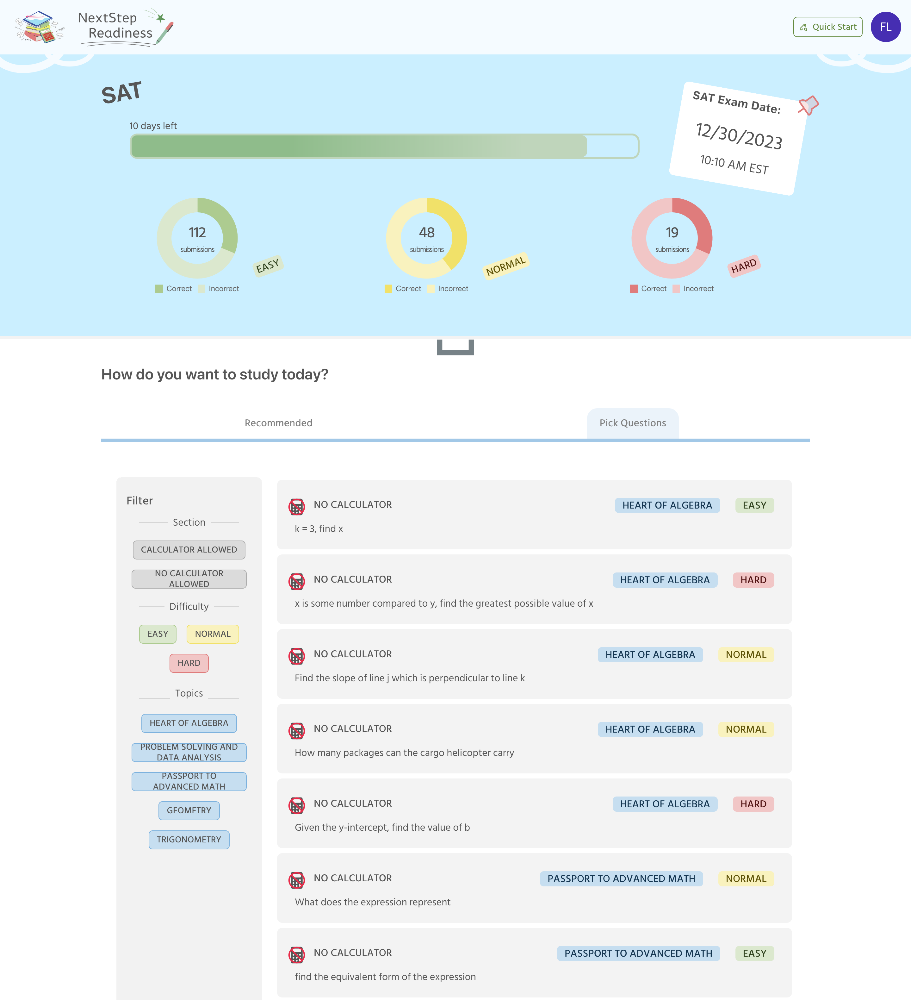
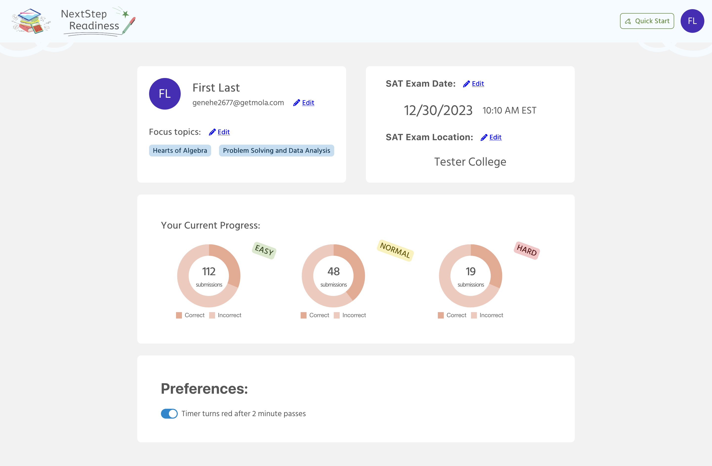
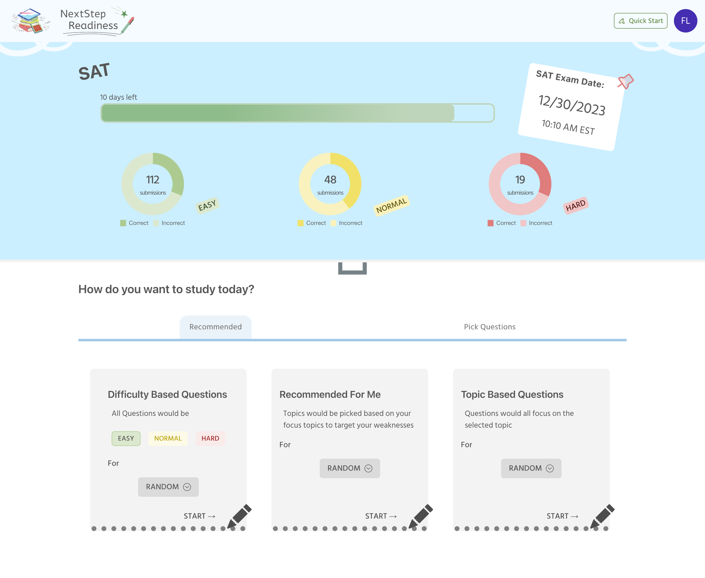
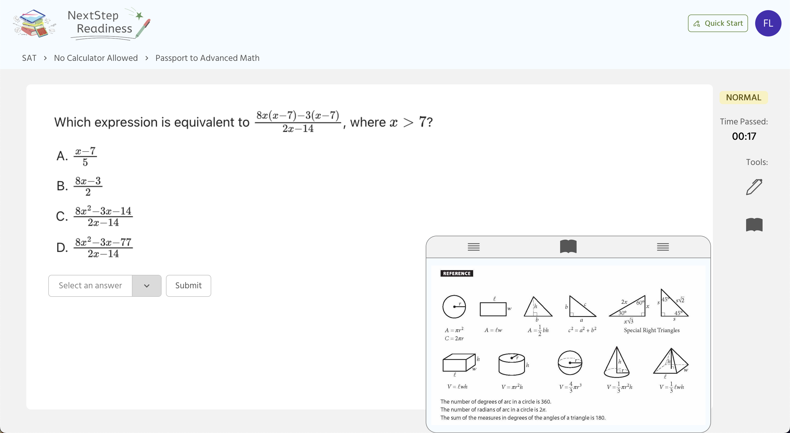

# NextStep Readiness

  

A study website that provides students a platform to sort and practice SAT math questions. Users could log in and personalize the topic they would like to focus and the detail of their SAT exam. Within the home page there are options to filter through questions based on topic and difficulty or start answering questions with specified parameters.  

## Technical Stack 
- React
- Django REST framework
- MySQL
- Firebase Authentication
- Firestore

## Features 
### Authentication

  

Firebase Authentication is used to authenticate and create new users on the website. User is able to specify topics they would like to focus on and details about their SAT exam within the settings page. Those information would be stored using Firestore.

### Home Page

  

#### Pick Question Tab
Within the home page user could filter through SAT questions based on the section, topic, and difficulty of the SAT question. 

#### Recommendation Tab
User could also choose to continously answer questions from a specified field using the recommendation cards. 

### Answers Page

  

#### Drawing Tool
User could draw on the answer page using the drawing tool. There are 4 ink colors and an eraser available
#### Calculator Tool
On a calculator allowed question, user could click on the calculator icon to pull up a drawer that would display a graphing calculator using Desmos API
#### Reference Tool
User could click on the book icon to pull up a drawer that would display the reference sheet at the start of a SAT exam

## Website Link
The website is deployed [here](https://alexy4744.github.io/capstone/)
